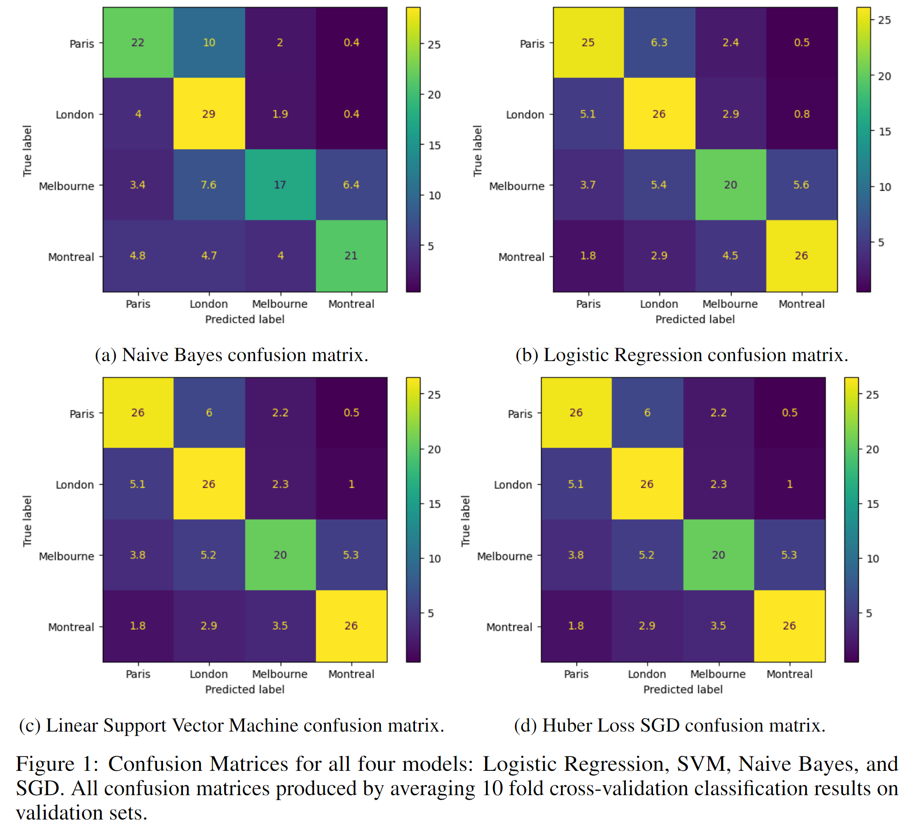

# ECSE 551 - Mini Project 2: Reddit Text Classification

## Running the program yourself
To reproduce results in A2.ipynb, please run code in the 'Setup' section first, but replace the path leading to the train.csv and test.csv to the location of the files on your machine accordingly. The rest of the notebook can be ran in order to run the corresponding tests and experiments. 

## Abstract

This project explored and evaluated the effectiveness of various machine learning
(ML) models in performing text classification. The text classification task was to
classify Reddit posts and comments to one of four cities: Montreal, Melbourne,
London, and Paris. A training dataset was provided by the course for the purpose
of this exploration and a corresponding Kaggle competition was used to return test
results. Before training the models, the following text pre-processing steps were
investigated: stopword removal, lemmatization, tokenization, and text vectorization.
Out of four models, Stochastic Gradient Descent (SGD) with Huber loss and linear
Support Vector Machine classifiers yielded the best results with accuracies of 72.8%
and 71.1% respectively in the Kaggle competition. The other models which did
not yield optimal results were Naive Bayes and Logistic Regression. Naive Bayes
was implemented without the use of pre-existing ML libraries for this assignment.
The hyperparameter optimization involved using SK Learn’s grid search class
and a custom 10-fold cross-validation.
We found that text pre-processing had a positive effect on model performance,
particularly since the dataset had samples with dirty characters. Confusion matrices
and additional metrics are reported. Notably, the F1 score, precision, and recall
were the greatest for the Montreal class for the two superior models, indicating that
the other classes were incorrectly identified more frequently. The model with the
best validation accuracy was SGD with Huber loss and is the same model which
scored the highest in the Kaggle competition.

## Preprocessing

### Reddit Post Text Classification Dataset
The text classification dataset contains posts from four subreddits: Montreal, Paris, Melbourne, and
Paris. The corpus has 1400 total samples, with 350 posts belonging to each subreddit. Based on
the langdetect library, 1039 posts were written in English and 361 posts in French. Using the regex
pattern *r"(?u)\b(\w+)\b")* to count the number of unique instances of alphanumeric characters across
the dataset, we found there were approximately 14913 unique words.

### Data Cleaning
When first loading the train.csv file, we used the "ISO-8859-1 encoding format since the default
UTF-8 encoding raised errors when reading certain characters across the training corpus. While
most text samples were expressed within the ASCII character set, tokens such as \x82 and \x85
appeared in place of special characters like é and à respectively. Additionally, it was also common to
see question marks replacing apostrophes within words, often in words with contractions like "isn’t".
In such cases, we created a mapping between what we think are the original characters and these
token substitutes and replaced them manually to help clean the data.

### Text Preprocessing
With the cleaned data, we performed stopword removal, lemmatization, and tokenization on the input
data before passing it to the corresponding model. Since the training corpus and test corpus include
English and French words, we processed each sample according to the language. For stopwords,
we included both common English and French stopwords from the NLTK and Spacy libraries, as
well as, a short list of other stopwords including www and http(s) which created a list of 949 total
stopwords. Subsets of these were considered in our following experiments. Similarly, to apply the
correct lemmatization we used langdetect to determine the language before applying either Wordnet
lemmatizer or French LEFFF (Lexique des Formes Fléchies du Français) lemmatizer on English
and French samples, respectively. We also use NLTK’s Part-Of-Speech Tag function to apply the
corresponding conjugation. Stemming was also considered, but we experimented with lemmatization
for better accuracy. Lastly, for word tokenization, we used the regex pattern *r"(?u)(?u)\b([a-z][a-
z]+)\b")* and the re library function findall() to split each sample into words that contained at least
two alphabetical characters and separated by whitespace or any punctuation.

## Models

For this project we investigated four supervised learning models: Bernoulli Naive Bayes, Logistic
Regression, Support Vector Machine (SVM), and a Stochastic Gradient Descent (SGD) classifier.
The last three models are from the SK Learn library. Naive Bayes was chosen as per assignment
instructions, while the other models were chosen due to their popularity as robust text classification
models. Each model also represents different levels of complexity and with varying number of
hyperparameters to tune which can potentially help fit to the data better.

## Results

The stochastic gradient descent model utilizing huber loss and the linear SVM models yielded the best performance in K-fold cross-validation displaying 28.6\% and 28.4\% average validation errors across 10 folds. Thus, these two models were the two most superior of the four models developed. When compared to each other and for the Kaggle competition, the Huber loss SGD model is our best performing model and will be used in the competition. This is mainly supported by the improved Kaggle accuracy, with SGD yielding approximately 2\% higher classification accuracy. When evaluating the classification performance of the models in more depth, there is a marginal difference. Both models exhibit superior performance classifying Reddit posts belonging to the Montreal subreddit, each reporting F1 scores of 78\%. Both models experienced similar degradation in the classification performance of posts belonging to the Paris and London subreddits, reporting F1 scores of approximately 73\% (72\% for SGD) and 70\%, respectively. Posts belonging to the Melbourne subreddit, however, easily reported the lowest classification performance for both models, reporting F1 score of 64\%. With the near identical F1 scores and average validation error, we used the kaggle accuracy as the deciding factor in our selection. 

When analyzing the classification performance metrics, interesting observations on the performance of all four models in classifying posts from the different subreddits come to light. Concerning the Melbourne subreddit in particular, all four developed models reported the worst classification performance when classifying posts belonging to this sub-reddit. F1 scores ranged between 58\% to 64\%, with recall scores of 51\%, 58\%, 59\%, and 59\% for the Naive Bayes, Logistic Regression, SVM, and SGD models, respectively. Precision scores were significantly better at 69\%, 67\%, 71\%, and 72\% for the same models. This suggests that, concerning the Melbourne class specifically, the four models are pessimistic in classifying posts to this subreddit, accurately classifying a low number of posts to this class, but missing a large number of posts that should have been classified there. For the London subreddit, the opposite behaviour is observed: models reported recall scores much higher than precision scores. This suggests that models were more liberal in classifying posts to the London subreddit, identifying a high number of positive cases, but also falsely classifying many posts. Potential explanations of this behavior include: ineffective data shuffling resulting in imbalanced datasets or ineffectual text pre-processing of primarily English words (likely why the Paris and Montreal posts have better performance as they're primarily in French). Different training approaches can be used to improve the overall performance: training two distinct models on the primarily French and English posts, respectively, and combining their outputs (weighted averaging or selecting a classifier based on the main language of the text), applying different threshold probabilities for classifying the output, employing higher thresholds to improve precision and lower thresholds to improve recall. 

